<!-- Generated by `mise run readme` from src/. Edit that, not this. -->

<picture><source media="(max-width: 600px)" srcset="https://github.com/jdx/jdx/raw/main/assets/phone/header.svg"></picture>
<picture><source media="(max-width: 600px)" srcset="https://github.com/jdx/jdx/raw/main/assets/phone/links.svg"></picture>
<a href="https://jdx.dev"><picture><source media="(max-width: 600px)" srcset="https://github.com/jdx/jdx/raw/main/assets/phone/links/1.svg"></picture></a><a href="https://jdx.dev/sponsors"><picture><source media="(max-width: 600px)" srcset="https://github.com/jdx/jdx/raw/main/assets/phone/links/2.svg"></picture></a><a href="https://x.com/jdxcode"><picture><source media="(max-width: 600px)" srcset="https://github.com/jdx/jdx/raw/main/assets/phone/links/3.svg"></picture></a><a href="https://bsky.app/profile/jdx.dev"><picture><source media="(max-width: 600px)" srcset="https://github.com/jdx/jdx/raw/main/assets/phone/links/4.svg"></picture></a><a href="https://fosstodon.org/@jdx"><picture><source media="(max-width: 600px)" srcset="https://github.com/jdx/jdx/raw/main/assets/phone/links/5.svg"></picture></a>
<picture><source media="(max-width: 600px)" srcset="https://github.com/jdx/jdx/raw/main/assets/phone/trending.svg"></picture>
<a href="https://mr-boxington.jdx.dev"><picture><source media="(max-width: 600px)" srcset="https://github.com/jdx/jdx/raw/main/assets/phone/trending/1.svg"></picture></a>
<a href="https://packslip.dev"><picture><source media="(max-width: 600px)" srcset="https://github.com/jdx/jdx/raw/main/assets/phone/trending/2.svg"></picture></a>
<a href="https://hk.jdx.dev"><picture><source media="(max-width: 600px)" srcset="https://github.com/jdx/jdx/raw/main/assets/phone/trending/3.svg"></picture></a>
<a href="https://fnox.jdx.dev"><picture><source media="(max-width: 600px)" srcset="https://github.com/jdx/jdx/raw/main/assets/phone/trending/4.svg"></picture></a>
<a href="https://aube.jdx.dev"><picture><source media="(max-width: 600px)" srcset="https://github.com/jdx/jdx/raw/main/assets/phone/trending/5.svg"></picture></a>
<a href="https://usage.jdx.dev"><picture><source media="(max-width: 600px)" srcset="https://github.com/jdx/jdx/raw/main/assets/phone/trending/6.svg"></picture></a>
<picture><source media="(max-width: 600px)" srcset="https://github.com/jdx/jdx/raw/main/assets/phone/trending/legend.svg"></picture>
<picture><source media="(max-width: 600px)" srcset="https://github.com/jdx/jdx/raw/main/assets/phone/stats.svg"></picture>
<picture><source media="(max-width: 600px)" srcset="https://github.com/jdx/jdx/raw/main/assets/phone/contribution-city.svg"></picture>
<picture><source media="(max-width: 600px)" srcset="https://github.com/jdx/jdx/raw/main/assets/phone/beyond-mise.svg"></picture>
<picture><source media="(max-width: 600px)" srcset="https://github.com/jdx/jdx/raw/main/assets/phone/installs.svg"></picture>
<picture><source media="(max-width: 600px)" srcset="https://github.com/jdx/jdx/raw/main/assets/phone/projects.svg"></picture>
<a href="https://mise.jdx.dev"><picture><source media="(max-width: 600px)" srcset="https://github.com/jdx/jdx/raw/main/assets/phone/projects/mise.svg"></picture></a><a href="https://fnox.jdx.dev"><picture><source media="(max-width: 600px)" srcset="https://github.com/jdx/jdx/raw/main/assets/phone/projects/fnox.svg"></picture></a>
<a href="https://aube.jdx.dev"><picture><source media="(max-width: 600px)" srcset="https://github.com/jdx/jdx/raw/main/assets/phone/projects/aube.svg"></picture></a><a href="https://hk.jdx.dev"><picture><source media="(max-width: 600px)" srcset="https://github.com/jdx/jdx/raw/main/assets/phone/projects/hk.svg"></picture></a>
<a href="https://usage.jdx.dev"><picture><source media="(max-width: 600px)" srcset="https://github.com/jdx/jdx/raw/main/assets/phone/projects/usage.svg"></picture></a><a href="https://pitchfork.jdx.dev"><picture><source media="(max-width: 600px)" srcset="https://github.com/jdx/jdx/raw/main/assets/phone/projects/pitchfork.svg"></picture></a>
<a href="https://mr-boxington.jdx.dev"><picture><source media="(max-width: 600px)" srcset="https://github.com/jdx/jdx/raw/main/assets/phone/projects/mr-boxington.svg"></picture></a><a href="https://github.com/jdx/demand"><picture><source media="(max-width: 600px)" srcset="https://github.com/jdx/jdx/raw/main/assets/phone/projects/demand.svg"></picture></a>
<a href="https://packslip.dev"><picture><source media="(max-width: 600px)" srcset="https://github.com/jdx/jdx/raw/main/assets/phone/projects/also-packslip.svg"></picture></a><a href="https://github.com/jdx/communique"><picture><source media="(max-width: 600px)" srcset="https://github.com/jdx/jdx/raw/main/assets/phone/projects/also-communique.svg"></picture></a><a href="https://mise.jdx.dev/lang/ruby.html"><picture><source media="(max-width: 600px)" srcset="https://github.com/jdx/jdx/raw/main/assets/phone/projects/also-ruby.svg"></picture></a><a href="https://github.com/jdx/tak"><picture><source media="(max-width: 600px)" srcset="https://github.com/jdx/jdx/raw/main/assets/phone/projects/also-tak.svg"></picture></a>
<picture><source media="(max-width: 600px)" srcset="https://github.com/jdx/jdx/raw/main/assets/phone/writing.svg"></picture>
<a href="https://jdx.dev/posts/2026-09-07-dotfiles-that-save-themselves/"><picture><source media="(max-width: 600px)" srcset="https://github.com/jdx/jdx/raw/main/assets/phone/writing/post-1.svg"></picture></a>
<a href="https://jdx.dev/posts/2026-09-05-introducing-packslip/"><picture><source media="(max-width: 600px)" srcset="https://github.com/jdx/jdx/raw/main/assets/phone/writing/post-2.svg"></picture></a>
<a href="https://jdx.dev/posts/2026-09-05-introducing-mr-boxington/"><picture><source media="(max-width: 600px)" srcset="https://github.com/jdx/jdx/raw/main/assets/phone/writing/post-3.svg"></picture></a>
<a href="https://jdx.dev/posts/2026-04-17-going-full-time-on-open-source/"><picture><source media="(max-width: 600px)" srcset="https://github.com/jdx/jdx/raw/main/assets/phone/writing/post-4.svg"></picture></a>
<a href="https://jdx.dev/posts/2026-03-02-10-mise-features/"><picture><source media="(max-width: 600px)" srcset="https://github.com/jdx/jdx/raw/main/assets/phone/writing/post-5.svg"></picture></a>
<a href="https://jdx.dev/posts/"><picture><source media="(max-width: 600px)" srcset="https://github.com/jdx/jdx/raw/main/assets/phone/writing/all-posts.svg"></picture></a>
<picture><source media="(max-width: 600px)" srcset="https://github.com/jdx/jdx/raw/main/assets/phone/footer.svg"></picture>

Regenerated daily by <code>mise run readme</code> (<a href="https://github.com/jdx/jdx">source</a>). Console design and contribution city by <a href="https://github.com/georgekobaidze/georgekobaidze">Giorgi Kobaidze</a> (<a href="https://dev.to/georgekobaidze/i-turned-my-github-profile-into-a-cyberpunk-console-with-a-city-built-from-my-contributions-h4c">how he built it</a>), used under MIT.

