<!-- Generated by `mise run readme` from src/render.ts. Edit that, not this. -->
<a href="https://jdx.dev"><picture><source media="(max-width: 600px)" srcset="https://github.com/jdx/jdx/raw/main/assets/header-narrow.svg"></picture></a>

I build and maintain developer tools full-time at [entire.io](https://entire.io). Most people know me for mise. Here's everything I make.

mise is 47.3k short of 1M monthly users.

**953k** [mise monthly users](https://mise-versions.jdx.dev/stats) · **43.8k** [stars](https://github.com/jdx?tab=repositories&sort=stargazers) · **48** [open issues](https://github.com/search?q=user%3Ajdx+org%3Aaubepkg+is%3Apublic+archived%3Afalse+is%3Aopen+is%3Aissue+-author%3Aapp%2Fgreenkeeper+-author%3Aapp%2Frenovate&type=issues) · **76** [open PRs](https://github.com/search?q=user%3Ajdx+org%3Aaubepkg+is%3Apublic+archived%3Afalse+is%3Aopen+is%3Apr+draft%3Afalse+-author%3Aapp%2Fdependabot+-author%3Aapp%2Fgithub-actions+-author%3Amise-en-dev+-author%3Aapp%2Frenovate+NOT+%22chore%3A+release%22+in%3Atitle&type=issues)

<p>
<a href="https://mise.jdx.dev"><picture><source media="(max-width: 600px)" srcset="https://github.com/jdx/jdx/raw/main/assets/card-mise-narrow.svg"></picture></a>
<a href="https://fnox.jdx.dev"><picture><source media="(max-width: 600px)" srcset="https://github.com/jdx/jdx/raw/main/assets/card-fnox-narrow.svg"></picture></a><a href="https://aube.jdx.dev"><picture><source media="(max-width: 600px)" srcset="https://github.com/jdx/jdx/raw/main/assets/card-aube-narrow.svg"></picture></a>
<a href="https://hk.jdx.dev"><picture><source media="(max-width: 600px)" srcset="https://github.com/jdx/jdx/raw/main/assets/card-hk-narrow.svg"></picture></a><a href="https://usage.jdx.dev"><picture><source media="(max-width: 600px)" srcset="https://github.com/jdx/jdx/raw/main/assets/card-usage-narrow.svg"></picture></a>
<a href="https://pitchfork.jdx.dev"><picture><source media="(max-width: 600px)" srcset="https://github.com/jdx/jdx/raw/main/assets/card-pitchfork-narrow.svg"></picture></a><a href="https://mr-boxington.jdx.dev"><picture><source media="(max-width: 600px)" srcset="https://github.com/jdx/jdx/raw/main/assets/card-mr-boxington-narrow.svg"></picture></a>
</p>

Try them all:

```sh
mise use -g fnox aube hk usage pitchfork mbx
```

**Also:** [demand](https://github.com/jdx/demand) prompts for Rust CLIs · [communique](https://github.com/jdx/communique) AI-edited release notes · [packslip](https://packslip.dev) signed vendor release manifests · [ruby](https://mise.jdx.dev/lang/ruby.html) precompiled Rubies · [tak](https://github.com/jdx/tak) CLI performance, tracked

### Latest writing

- Sep 7 · [Dotfiles That Save Themselves](https://jdx.dev/posts/2026-09-07-dotfiles-that-save-themselves/): Track the configuration you already use, recover mistakes, and bring your setup to another machine with mise.
- Sep 5 · [Introducing packslip](https://jdx.dev/posts/2026-09-05-introducing-packslip/): Install tools directly from vendors, with completions and agent skills that match the version you're using.
- Sep 5 · [Introducing mr-boxington: fix target/](https://jdx.dev/posts/2026-09-05-introducing-mr-boxington/): A shared, self-pruning build cache for Rust. Keep using Cargo, reuse compilations across worktrees, and run builds…

[All posts](https://jdx.dev/posts/) · [RSS](https://jdx.dev/posts/index.xml)

<sub><a href="https://jdx.dev/sponsors">Sponsor</a> · <a href="https://jdx.dev/members">Members</a> · <a href="https://jdx.dev">jdx.dev</a></sub><br>
<sub>Regenerated daily by <code>mise run readme</code> (<a href="https://github.com/jdx/jdx">source</a>). SVG cards inspired by <a href="https://github.com/georgekobaidze/georgekobaidze">Giorgi Kobaidze</a>'s profile (<a href="https://dev.to/georgekobaidze/i-turned-my-github-profile-into-a-cyberpunk-console-with-a-city-built-from-my-contributions-h4c">how he built it</a>).</sub>
